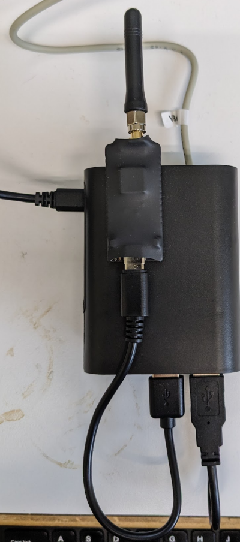
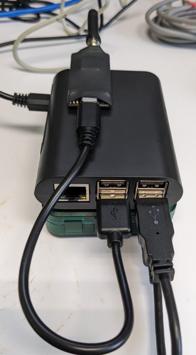

# Notes on Installation of System

Here are two pics of the finished unit:

- The bottom green box is the VBus-USB adapter.  You have to remove a screw to install a 2-wire cable that goes from that box to the Resol controller. 
- There is no polarity for the 2-wire cable, as stated in the manual, and I also tested it both ways.
- I'm using 3M Dual-Lock (velcro-like strips) to attach the Le Potato (think Pi) to the VBus-USB converter, and to attach the LoRa Radio to the Le Potato.
- There are nice mounting holes in the VBus converter that allow mounting that bottom green unit to the wall; I've included sheet rock anchors and wood screw (#1 square head) for mounting. 
- I'm shipping without the cables attached.  All cables have different plugs on one end, so there shouldn't be any confusion.  You can use any two USB ports on the Le Potato, but I've been using the bottom two so that it is easy to insert a Thumb Drive for debug purposes (more on that later).
- The only box that needs power attached to it is the Le Potato; I've included a USB charger and USB cable for that purpose. The LePotato powers the other two boxes via the USB ports.
- There are two labels on the system: one narrow label on the LoRa Radio that gives the last 5 digits of the Dev EUI.  The sensor data will come into BMON with that Dev EUI, so it is important to keep track of those 5 digits by location where the unit is installed. The wider label has 12 digits, and is the MAC address of the LePotato.  The debug file discussed next will have a filename that uses that address, so keep track of that by location as well.
- After you power things up, it would be good to get some status and debug information from the system.  You can do that by inserting a Flash Drive into the Le Potato for 10 seconds,  but make sure you give the Le Potato time to boot up before inserting (30 seconds would be enough). The Le Potato will write a file on the Flash drive with a bunch of debug info.  This is most important if we're having problems. You can email me that file, and it will help me determine the problem.